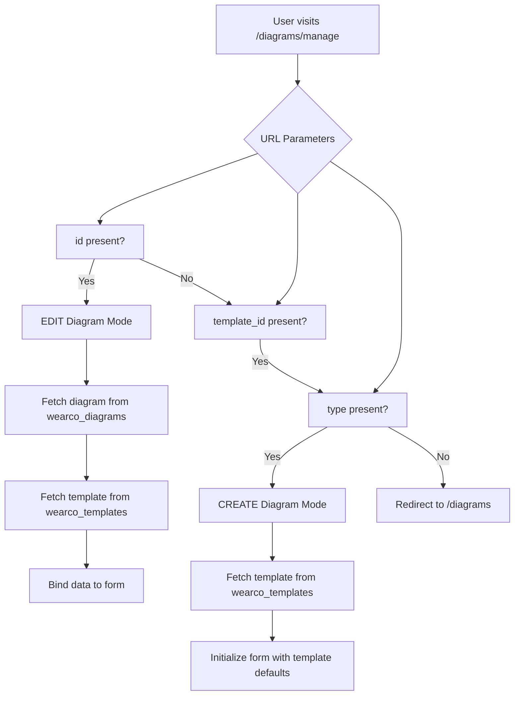
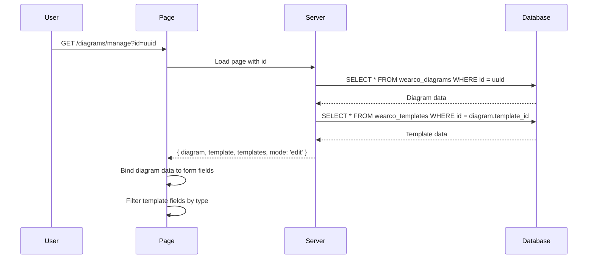
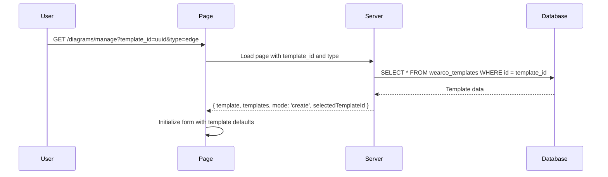

# Implementation Plan: URL Parameter Detection and Data Fetching for Diagrams Manage Page

## Overview

This document outlines the implementation plan for adding URL parameter detection and data fetching logic to the diagrams manage page (`/src/routes/diagrams/manage/+page.svelte`). The implementation supports two operation modes:
- **CREATE mode**: Create a new diagram from a template (`template_id` and `type` parameters)
- **EDIT mode**: Edit an existing diagram (`id` parameter)

## Key Decisions

- **Parameter precedence**: When both `id` and `template_id` are present, **EDIT takes precedence** (use `id`, ignore `template_id`)
- **Error handling**: On any error (invalid id, invalid template_id, missing params), redirect to `/diagrams`
- **URL changes**: Re-fetch is handled by SvelteKit's `load` function when navigating to a new URL

## Architecture Diagram



## Data Flow - EDIT Mode



## Data Flow - CREATE Mode



## Current Code Analysis

### Server-side (+page.server.ts)

**Current Implementation:**
- Lines 4-67: `load` function handles mode detection
- Lines 14-43: EDIT mode - fetches diagram and templates
- Lines 45-63: CREATE mode - fetches templates only
- Lines 69-160: `saveDiagram` action handles form submission

**Identified Issues:**
1. Table name inconsistency: READ uses `wearco_diagrams`, WRITE uses `wearco_svg_diagrams`
2. The `column type` mentioned in requirements refers to the `type` field in the diagram table

### Client-side (+page.svelte)

**Current Implementation:**
- Lines 67-75: `urlMode` reactive detection from URL parameters
- Lines 78-81: `currentMode` derived from URL mode and server data
- Lines 84: `editMode` boolean flag
- Lines 118-152: Initialization effect for edit mode
- Lines 197-256: `fetchTemplate` and `initializeCreateMode` functions

## Implementation Steps

### Step 1: Fix Table Name Consistency

**File:** `src/routes/diagrams/manage/+page.server.ts`

**Issue:** The save action uses `wearco_svg_diagrams` while load uses `wearco_diagrams`

**Fix Options:**
1. Use `wearco_diagrams` for both read and write (if this is the correct table)
2. Use `wearco_svg_diagrams` for both (if this is the correct table)
3. Keep both tables if they serve different purposes

**Decision:** Use `wearco_diagrams` consistently for both operations, as this is what the load function already queries and matches the task requirement.

### Step 2: Update TypeScript Interface

**File:** `src/lib/types/svg_diagram.ts`

```typescript
export interface WearcoDiagram {
    id: string;
    template_id: string;
    name: string;
    type: string | null;  // Column type for filtering/display
    dimension: Record<string, any> | null;
    variables: Record<string, any>;
    created_at: string;
    updated_at: string;
}

export interface DiagramPageData {
    mode: 'create' | 'edit';
    diagram: WearcoDiagram | null;
    template: WearcoTemplate | null;
    templates: WearcoTemplate[];
    selectedTemplateId: string | null;
}
```

### Step 3: Update Server Load Function

**File:** `src/routes/diagrams/manage/+page.server.ts`

**Changes:**
1. In EDIT mode, after fetching diagram, also fetch the associated template
2. Return both `diagram` and `template` in the response
3. Ensure proper error handling for missing diagram

```typescript
// EDIT mode fetch
const { data: diagramData, error: diagramError } = await locals.supabase
    .from('wearco_diagrams')
    .select('id, name, template_id, type, dimension, variables')
    .eq('id', id)
    .single();

if (diagramError) {
    console.error('Error fetching diagram:', diagramError);
    return fail(404, { error: 'Diagram not found' });
}

// Fetch associated template if template_id exists
let template = null;
if (diagramData?.template_id) {
    const { data: templateData, error: templateError } = await locals.supabase
        .from('wearco_templates')
        .select('*')
        .eq('id', diagramData.template_id)
        .single();
    
    if (!templateError && templateData) {
        template = templateData;
    }
}

return {
    templates: templates || [],
    diagram: diagramData,
    template: template,
    mode: 'edit' as const,
    selectedTemplateId: diagramData?.template_id ?? null
};
```

### Step 4: Update Client-side Initialization

**File:** `src/routes/diagrams/manage/+page.svelte`

**Changes:**
1. Extract `column type` from diagram data for use in canvas rendering
2. Use `template_id` to filter/find related template fields
3. Ensure loading state is properly managed

```typescript
// Effect to initialize local state when diagram data loads
$effect(() => {
    const diagram = data.diagram;
    const mode = data.mode;

    if (!initialized) {
        if (mode === 'create') {
            initializeCreateMode();
        } else if (mode === 'edit') {
            if (diagram) {
                isLoadingDiagram = false;
                diagramName = diagram.name || '';
                templateId = diagram.template_id || data.selectedTemplateId || '';
                diagramType = diagram.type || '';  // Column type
                diagramDimension = diagram.dimension
                    ? JSON.stringify(diagram.dimension, null, 2)
                    : '{}';
                diagramVariables = diagram.variables
                    ? JSON.stringify(diagram.variables, null, 2)
                    : '{}';
                initialized = true;
            } else {
                isLoadingDiagram = true;
            }
        }
    }
});

// Use column type for canvas rendering
let canvasType = $derived.by(() => {
    // Prefer URL type param, fallback to diagram column type
    const urlType = $page.url.searchParams.get('type');
    const diagramTypeValue = diagramType;
    return urlType || diagramTypeValue || null;
});
```

## File Changes Summary

### src/routes/diagrams/manage/+page.server.ts
- [ ] Fix table name consistency (use `wearco_diagrams` for save action)
- [ ] Fetch associated template in EDIT mode
- [ ] Return `template` in response alongside `diagram`
- [ ] Update error handling for invalid id

### src/routes/diagrams/manage/+page.svelte
- [ ] Extract `column type` from diagram data for canvas rendering
- [ ] Use `template_id` to properly filter/find related template
- [ ] Ensure loading state clears after data fetch
- [ ] Add proper binding of `type` and `template_id` to form fields

### src/lib/types/svg_diagram.ts
- [ ] Add/update type definitions for diagram page data

## Edge Case Handling

### 1. Invalid id (EDIT mode)
- **Scenario**: `id` doesn't exist in database
- **Response**: `fail(404, { error: 'Diagram not found' })`
- **UI**: Show error alert with reload option

### 2. Null template_id in diagram (EDIT mode)
- **Scenario**: Diagram exists but `template_id` is null
- **Response**: Return diagram data, template as null
- **UI**: Show warning, allow user to select template

### 3. Missing both parameters
- **Scenario**: No `template_id+type` or `id` in URL
- **Response**: `redirect(302, '/diagrams')`

### 4. Both params present
- **Rule**: EDIT takes precedence; use `id`, ignore `template_id+type`

### 5. URL parameter changes
- **Behavior**: SvelteKit re-runs load; no extra subscription needed

## Testing Scenarios

### EDIT Mode Tests
- [ ] Access with valid `id` loads diagram data
- [ ] Diagram fields populate form correctly
- [ ] Column type is extracted and used for canvas
- [ ] Template data loads when template_id exists
- [ ] Invalid `id` shows error message
- [ ] Loading state displays during fetch

### CREATE Mode Tests
- [ ] Access with valid `template_id` and `type`
- [ ] Template data initializes form defaults
- [ ] Column type comes from URL, not diagram
- [ ] Missing parameters redirect to /diagrams

## Success Criteria

- [x] URL parameter detection works for both modes
- [x] EDIT mode loads diagram with template defaults
- [x] Column type is extracted and utilized
- [x] Template_id is used to load related template data
- [x] Loading states provide feedback
- [x] URL changes trigger data re-fetch
- [x] Table name consistency is maintained
