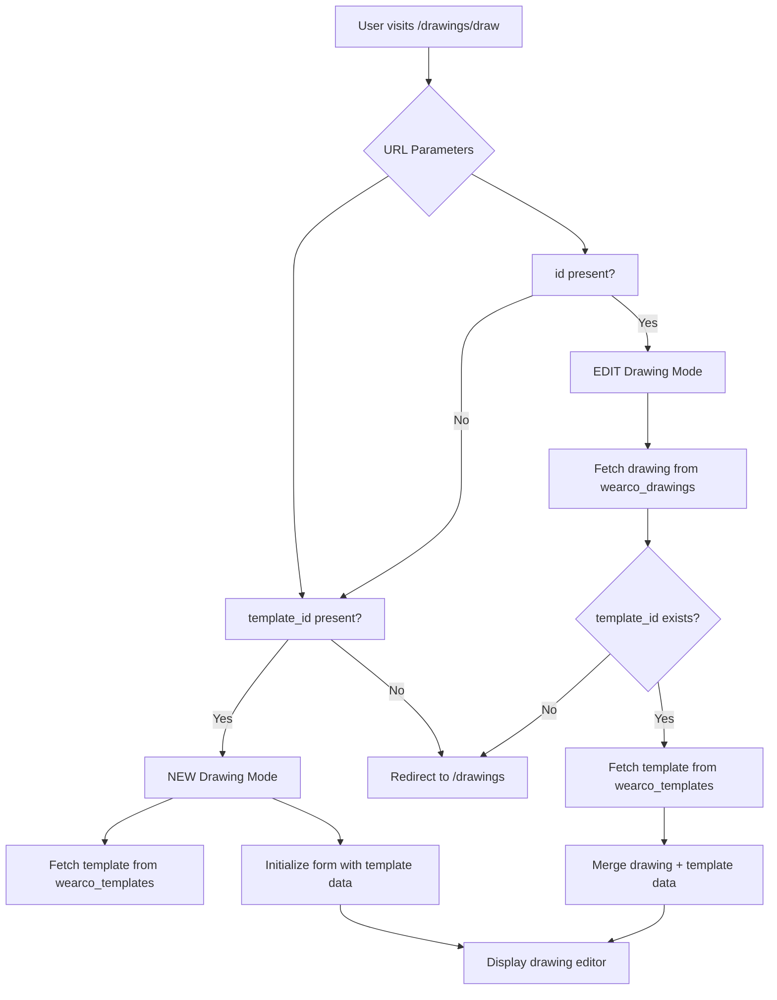
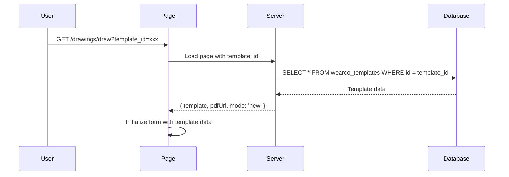
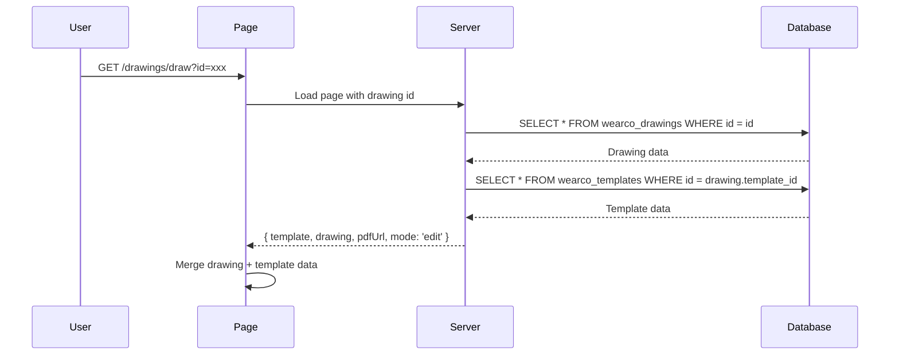

# Implementation Plan: URL Parameter Detection and Data Fetching

## Overview

This document outlines the implementation plan for adding URL parameter detection and data fetching logic to the drawing editor page (`/src/routes/drawings/draw/+page.svelte`). The implementation will support two operation modes:
- **NEW mode**: Create a new drawing from a template (`template_id` parameter)
- **EDIT mode**: Edit an existing drawing (`id` parameter)

**Decisions (clarifications):**
- **Parameter precedence**: When both `id` and `template_id` are present, **EDIT takes precedence** — use `id` and ignore `template_id`.
- **Save action**: Out of scope for this phase; no save/create/update implementation.
- **Error handling**: On any error (invalid id, invalid template_id, missing params, or drawing with null template_id), **redirect** the user to `/drawings` (e.g. `redirect(302, '/drawings')`). No inline error state or SvelteKit error page for these cases.
- **Null template_id**: Redirect to `/drawings` (leave detailed handling for later).
- **URL changes**: Re-fetch is handled by SvelteKit's `load` when the user navigates to a new URL; no `$effect` or URL subscription needed.

## Architecture Diagram



## Data Flow

### NEW Drawing Mode (template_id parameter)



### EDIT Drawing Mode (id parameter)



## Implementation Steps

### Step 1: Update +page.server.ts

Modify `src/routes/drawings/draw/+page.server.ts` to:

1. Detect operation mode based on URL parameters
2. Handle both `template_id` (NEW) and `id` (EDIT) parameters
3. For EDIT mode: fetch drawing first, then fetch associated template
4. Return combined data including operation mode

**Key changes:**
- Accept both `template_id` and `id` parameters; **if `id` is present, EDIT takes precedence** (ignore `template_id`).
- If `id` is present → EDIT mode
- If only `template_id` is present → NEW mode
- Return `mode`, `template`, `drawing`, `pdfUrl` in response
- On error (missing params, not found, null template_id): **redirect to `/drawings`** via `redirect(302, '/drawings')`

### Step 2: Update +page.svelte

Modify `src/routes/drawings/draw/+page.svelte` to:

1. Add reactive state for drawing data
2. Display operation mode indicator
3. Initialize form fields based on merged template + drawing data
4. Add loading states during data fetching
5. URL parameter changes: re-fetch is automatic via SvelteKit `load` on navigation; no extra subscription needed.

**Key additions:**
- `drawing` state object for form fields
- `operationMode` derived state ('new' | 'edit')
- Reactive statement to merge template + drawing data
- Loading spinner and state management
- Edit mode indicator and metadata display

### Step 3: Define TypeScript Interfaces

Add to or update existing types:

```typescript
interface DrawingFormData {
    job_number: string;
    work_order: string;
    drawing_number: string;
    name: string;
    customer: string;
    customer_source: string;
    quantity: number;
    dl: string;
    checked_by: string;
    prog_by: string;
    material: string;
    thk: string;
    additional_data: Record<string, any>;
    drawing_data: Record<string, any>;
}

interface DrawingPageData {
    mode: 'new' | 'edit';
    template: WearcoTemplate;
    drawing: WearcoDrawing | null;
    pdfUrl: string | undefined;
}
```

## Data Structure Mapping

### Template Fields (Base defaults)

| Field | Type | Usage |
|-------|------|-------|
| `template_name` | string | Default drawing name |
| `category` | string | Category selection |
| `template_data` | Record | Base configuration |
| `visual_document` | string | PDF display |
| `image_display` | string | Thumbnail/image |
| `description` | string | Instructions/notes |

### Drawing Fields (Overrides template defaults)

| Field | Type | Usage |
|-------|------|-------|
| `job_number` | string | Job identification |
| `work_order` | string | Work order reference |
| `drawing_number` | string | Drawing identifier |
| `name` | string | Drawing name (overrides template_name) |
| `customer` | string | Customer name |
| `customer_source` | string | Where customer came from |
| `quantity` | number | Production quantity |
| `dl` | string | Delivery location |
| `checked_by` | string | QC checker |
| `prog_by` | string | Programmer |
| `material` | string | Material type |
| `thk` | string | Thickness |
| `additional_data` | Record | Custom fields |
| `drawing_data` | Record | Drawing-specific data |

## Edge Case Handling

All error cases: **redirect to `/drawings`** (e.g. `redirect(302, '/drawings')`). No inline error UI or SvelteKit error page for these.

### 1. Both `id` and `template_id` present
- **Rule**: EDIT takes precedence; use `id`, ignore `template_id`.

### 2. Invalid template_id (NEW mode)
- **Scenario**: `template_id` doesn't exist in database
- **Response**: Redirect to `/drawings`

### 3. Invalid id (EDIT mode)
- **Scenario**: `id` doesn't exist in database
- **Response**: Redirect to `/drawings`

### 4. Null template_id in drawing (EDIT mode)
- **Scenario**: Drawing exists but `template_id` is null
- **Response**: Redirect to `/drawings` (detailed handling left for later)

### 5. Missing both parameters
- **Scenario**: No `template_id` or `id` in URL
- **Response**: Redirect to `/drawings`

### 6. URL parameter changes
- **Scenario**: User navigates from one drawing to another (e.g. new URL)
- **Behavior**: SvelteKit re-runs load with the new URL; no extra subscription needed.

## File Changes Summary

### src/routes/drawings/draw/+page.server.ts
- [ ] Add mode detection logic (id takes precedence over template_id)
- [ ] Implement EDIT mode (fetch drawing → fetch template)
- [ ] On any error: redirect to `/drawings`
- [ ] Return combined data structure (mode, template, drawing, pdfUrl)

### src/routes/drawings/draw/+page.svelte
- [ ] Add drawing state object
- [ ] Add operation mode derived state
- [ ] Add form field initialization logic
- [ ] Add loading states and transitions
- [ ] Display operation mode indicator

## Testing Scenarios

1. **NEW mode**: Access with valid `template_id`
   - [ ] Template data loads correctly
   - [ ] Form initialized with template defaults
   - [ ] PDF displays if available

2. **EDIT mode**: Access with valid `id`
   - [ ] Drawing data loads correctly
   - [ ] Template data loads correctly
   - [ ] Drawing fields override template defaults
   - [ ] PDF displays correctly

3. **Edge cases** (all redirect to /drawings):
   - [ ] Invalid `template_id` redirects
   - [ ] Invalid `id` redirects
   - [ ] Null template_id in drawing redirects
   - [ ] Missing parameters redirects
   - [ ] Both params present: EDIT (id) wins

4. **Navigation**:
   - [ ] Changing URL parameters re-fetches data
   - [ ] Previous data is cleared before new data loads
   - [ ] Loading state displays during fetch

## Success Criteria

- ✅ URL parameter detection works for both modes
- ✅ NEW mode creates form from template
- ✅ EDIT mode loads drawing with template defaults
- ✅ Edge cases handled gracefully
- ✅ Loading states provide feedback
- ✅ URL changes trigger data re-fetch
